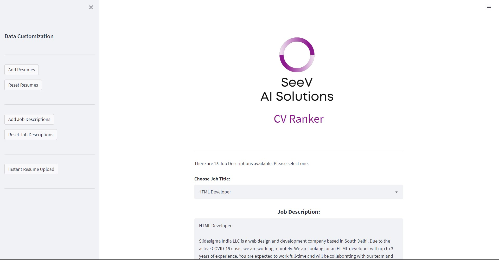
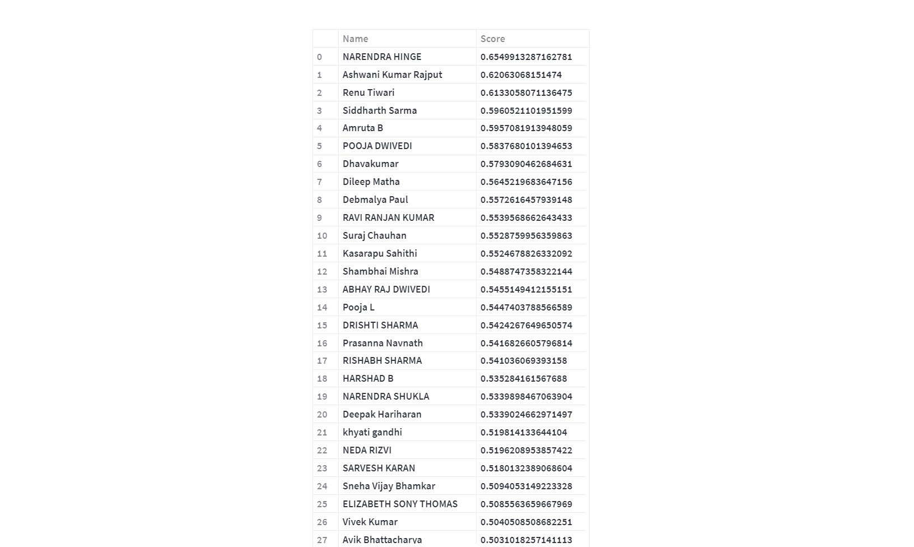

# SeeV : The AI-Powered CV Ranker

A resume ranking application that uses various ML/DL algorithms to automatically evaluate and rank a candidate’s resume from a pool of available candidate resumes using input criteria from the detailed JD.





---
## Features

* Understanding of text used: We look into the relevance of the sentence as a whole rather than just focusing on the exact words
* Wider Keyword domain: Identification of common words that are used interchangeably in the industry.
* Abbreviation Identification: True intents behind those short forms will no longer be ignored!
* Freedom of Fonts: The users will be able to use the font of their choice and make use of the graphical elements.
* Graphic Text Understanding: The software can detect information even from the graphic displays.

---
## Impact

Applications in bulk are hectic to deal with so, our software is designed to streamline the process of gathering, analyzing, and sorting resumes in accordance with the job description. The tailored MCQ test will make sure that no one cheats the system and that selections are fair. This will also let the candidates use rather unconventional resume formats and graphical aspects to display their skillset. 

---
## Steps

- Upload required Resumes and Job Descriptions, in any format into their respective folders in the Data folder.
- Download the Universal Sentence Encoder model into your local machine.
- Run the model.

---
## How to Run

```cmd
streamlit run app.py
```

---
## Sample

Sample resumes and job descriptions are provided in the Data folder.
